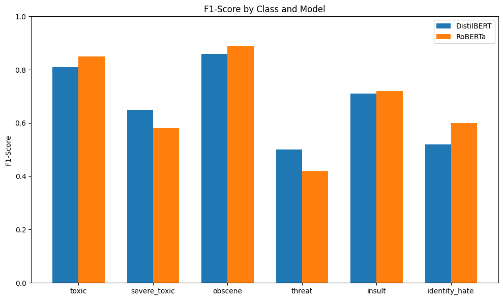

# Toxic Comment Classification with Large Language Models

## One Sentence Summary
This project classifies online comments into six toxicity categories using two transformer-based models (DistilBERT and RoBERTa) with Hugging Face Transformers, oversampling, and threshold tuning.

---

## Overview
The goal of this project is to build a multi-label text classification model to detect toxic comments across six categories: **toxic, severe_toxic, obscene, threat, insult, identity_hate**. Using a Kaggle dataset of over 150,000 comments, we trained and evaluated transformer-based models ( **DistilBERT** and **RoBERTa** ) for performance comparison. The best-performing model, RoBERTa, achieved an overall weighted F1-score of **0.89** after threshold tuning, showing strong capability in identifying multiple forms of toxic language. The project workflow included data cleaning, tokenization, handling class imbalance through oversampling, hyperparameter tuning, and visualizing results using classification reports, ROC curves, and bar plots.

---

## Summary of Work Done

### Data

- **Type**: Text (user comments)
- **Labels**: Multi-label (6 binary columns)
- **Classes**:
  - toxic  
  - severe_toxic  
  - obscene  
  - threat  
  - insult  
  - identity_hate

**Dataset Source**  
We used a subset of the [Jigsaw Toxic Comment Classification Challenge](https://www.kaggle.com/c/jigsaw-toxic-comment-classification-challenge) dataset.

---

### Preprocessing

- Removed missing values in `comment_text`
- Split dataset into training and validation sets (80/20 split)
- Applied **oversampling** using `RandomOverSampler` from `imblearn` to balance class distributions, especially for rare labels like `threat` and `identity_hate`
- Tokenized text using the respective model tokenizers (`DistilBERTTokenizerFast` and `RobertaTokenizerFast`) with:
  - `max_length=128`
  - `padding='max_length'`
  - `truncation=True`
- Converted to Hugging Face `Dataset` format with PyTorch tensors

---

### Problem Formulation

- **Input**: Raw comment text
- **Output**: 6 binary labels (multi-label classification)
- **Task**: Detect one or more types of toxic behavior per comment

---

## Models Trained

### Transformer Models

- **DistilBERT** (`distilbert-base-uncased`)
- **RoBERTa** (`roberta-base`)

Both models were fine-tuned for multi-label classification by adding a classification head with 6 output neurons and a sigmoid activation.

---

## Training

- **Software**: Python 3, Google Colab
- **Libraries**: Transformers, Datasets, PyTorch, scikit-learn, matplotlib, imbalanced-learn
- **Epochs**: 1–2 (due to GPU constraints)
- **Optimizer**: AdamW
- **Loss**: Binary Cross-Entropy with Logits (`BCEWithLogitsLoss`)
- **Evaluation Strategy**: per-epoch validation
- **Environment**: Google Colab GPU

---

## Performance Comparison

We first trained each model with a default threshold of **0.5** for all labels, then tuned thresholds individually to maximize per-class F1-score.

### F1-scores After Threshold Tuning

| Label          | DistilBERT | RoBERTa |
|----------------|------------|---------|
| toxic          | 0.81       | 0.85    |
| severe_toxic   | 0.65       | 0.58    |
| obscene        | 0.86       | 0.89    |
| threat         | 0.50       | 0.42    |
| insult         | 0.71       | 0.72    |
| identity_hate  | 0.52       | 0.60    |

---

### Bar Plot: F1-score Comparison


### ROC Curves


---

## Conclusions

Both DistilBERT and RoBERTa performed well on high-frequency labels like `toxic`, `obscene`, and `insult`, with F1-scores above 0.7. However, rare labels like `threat` and `identity_hate` remained challenging despite oversampling and threshold tuning, showing low recall.  
RoBERTa slightly outperformed DistilBERT overall, particularly in `toxic`, `obscene`, and `identity_hate`, but DistilBERT had a better score for `severe_toxic` and `threat`.  
Future improvements could include:
- More epochs with learning rate scheduling
- Advanced data augmentation for text
- Ensemble methods combining both models

---

## How to Reproduce Results

1. Clone this repository
2. Install dependencies:
   ```bash
   pip install transformers datasets torch scikit-learn imbalanced-learn matplotlib
   ```
3. Run the notebooks in order:
 - Feasibility&Prototype.ipynb
 - Toxic_Comment_Model_Improvements.ipynb
4. Compare the results

---

## Files in Repository

| File                                    | Description                                           |
|-----------------------------------------|-------------------------------------------------------|
| `Feasibility&Prototype.ipynb`           | Initial feasibility study, data preprocessing, and prototype model training |
| `Toxic_Comment_Model_Improvements.ipynb`| Second phase with model refinements, threshold tuning, and performance comparison |
| `/Pictures`                             | Folder containing plots, figures, and visualizations  |


---

## Software Setup

```bash
pip install tensorflow matplotlib scikit-learn
